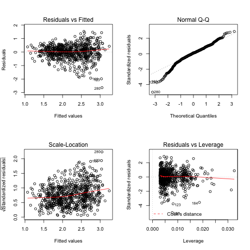

Homework # 6 UW Data Science course by rvij@cisco.com
========================================================

# Define functions used in the homework 


```r
setwd("/Users/rajeevvij/Documents/DOcRep/~DataScienceCisco/Module2")

# Reading data from the given files into R
readFromFiles <- function() {
    print("Read data files and print summaries")
    adultfev <<- read.csv("/Users/rajeevvij/Documents/DOcRep/~DataScienceCisco/Module2/adultfev.csv", 
        header = T, sep = ",", colClasses = c("character", "integer", "numeric", 
            "numeric", "factor", "factor"))
    adultfevmiss <<- read.csv("/Users/rajeevvij/Documents/DOcRep/~DataScienceCisco/Module2/adultfevmiss.csv", 
        header = T, sep = ",", colClasses = c("character", "integer", "numeric", 
            "numeric", "factor", "factor"))
    print(summary(adultfev))
    print(summary(adultfevmiss))
}

# Estimate the adjusted effect of smoking on fev.  The assumptions of linear
# regression that we covered in class were linearity, normality of
# residuals, homoskedasticity of residuals, and independence of residuals.
# Using qqplots, and boxplots of the residuals, assess these assumptions for
# the proposed analysis.  (note, one of the assumptions does not apply for a
# binary explanatory variable).


question1 <- function() {
    print("Perform lm and plot dignistic charts for the residuals against different variables")
    lm1 <<- lm(fev ~ smoke + height + age + male, data = adultfev)
    summarylm1 <<- summary(lm1)
    anovalm1 <<- anova(lm1)
    par(mfrow = c(2, 2))
    plot(lm1)
    par(mfrow = c(2, 2))
    qqplot(adultfev$smoke, lm1$resid)
    qqplot(adultfev$male, lm1$resid)
    qqplot(adultfev$age, lm1$resid)
    qqplot(adultfev$height, lm1$resid)
}


question2 <- function() {
    print("Print summary of the lm and provide details of the p-value and slopes")
    print(summarylm1)
    print(anovalm1)
}

question3 <- function() {
    print("How to address violations of the assumptions in lm")
    print("Use transformation of variables to address linearity and homoskedasticity of residuals")
    print("===========")
}

question4 <- function() {
    print("Perform lm with missing data anf complete cases")
    adultfevmissing_cc <- adultfevmiss[complete.cases(adultfevmiss), ]
    lm1cc <<- lm(fev ~ smoke + height + age + male, data = adultfevmissing_cc)
    summarylm1cc <- summary(lm1cc)
    anovalm1cc <- anova(lm1cc)
    print(summarylm1cc)
    print(anovalm1cc)
}

question5 <- function() {
    print("Impute missing data using mice package and compare with complete lm")
    require(mice)
    adultfevmiss.imputed <- mice(adultfevmiss)
    
    summarylmcc <- summary(lm(fev ~ smoke + height + age + male, data = adultfevmiss))
    
    impute.fit <- with(adultfevmiss.imputed, lm(fev ~ smoke + height + age + 
        male))
    print(summarylmcc)
    print(summary(pool(impute.fit)))
}

question6 <- function() {
    print("Calculate the power of a test")
    power08 <- power.t.test(n = 300, power = 0.8, sd = 75)
    power09 <- power.t.test(n = 300, power = 0.9, sd = 75)
    print(power08)
    print(power09)
}
```


# Call functions used in the homework for different questions

## Read data files and print summaries


```r
readFromFiles()
```

```
## [1] "Read data files and print summaries"
##       X                  age            fev            height     male   
##  Length:725         Min.   :65.0   Min.   :0.408   Min.   :54.5   0:363  
##  Class :character   1st Qu.:71.0   1st Qu.:1.745   1st Qu.:62.0   1:362  
##  Mode  :character   Median :74.0   Median :2.158   Median :65.5          
##                     Mean   :74.6   Mean   :2.207   Mean   :65.3          
##                     3rd Qu.:78.0   3rd Qu.:2.649   3rd Qu.:68.5          
##                     Max.   :99.0   Max.   :4.471   Max.   :75.0          
##  smoke  
##  0:629  
##  1: 96  
##         
##         
##         
##         
##       X                  age            fev            height     male   
##  Length:735         Min.   :65.0   Min.   :0.408   Min.   :57.0   0:369  
##  Class :character   1st Qu.:71.0   1st Qu.:1.745   1st Qu.:63.0   1:366  
##  Mode  :character   Median :74.0   Median :2.158   Median :66.5          
##                     Mean   :74.6   Mean   :2.207   Mean   :66.1          
##                     3rd Qu.:78.0   3rd Qu.:2.649   3rd Qu.:69.0          
##                     Max.   :99.0   Max.   :4.471   Max.   :75.0          
##                                    NA's   :10      NA's   :200           
##  smoke  
##  0:636  
##  1: 99  
##         
##         
##         
##         
## 
```


## Perform lm and plot digonistic plots 

```r
question1()
```

```
## [1] "Perform lm and plot dignistic charts for the residuals against different variables"
```

  

## Print summary of the lm and provide details of the p-value and slopes

```r
question2()
```

```
## [1] "Print summary of the lm and provide details of the p-value and slopes"
## 
## Call:
## lm(formula = fev ~ smoke + height + age + male, data = adultfev)
## 
## Residuals:
##     Min      1Q  Median      3Q     Max 
## -2.6390 -0.2668  0.0498  0.3145  1.5276 
## 
## Coefficients:
##             Estimate Std. Error t value Pr(>|t|)    
## (Intercept) -0.68304    0.61795   -1.11     0.27    
## smoke1      -0.35473    0.05872   -6.04  2.5e-09 ***
## height       0.07160    0.00799    8.96  < 2e-16 ***
## age         -0.02515    0.00371   -6.78  2.6e-11 ***
## male1        0.27452    0.06061    4.53  6.9e-06 ***
## ---
## Signif. codes:  0 '***' 0.001 '**' 0.01 '*' 0.05 '.' 0.1 ' ' 1
## 
## Residual standard error: 0.532 on 720 degrees of freedom
## Multiple R-squared:  0.405,	Adjusted R-squared:  0.401 
## F-statistic:  122 on 4 and 720 DF,  p-value: <2e-16
## 
## Analysis of Variance Table
## 
## Response: fev
##            Df Sum Sq Mean Sq F value  Pr(>F)    
## smoke       1   10.9    10.9    38.5 9.1e-10 ***
## height      1  111.2   111.2   393.0 < 2e-16 ***
## age         1   10.6    10.6    37.4 1.6e-09 ***
## male        1    5.8     5.8    20.5 6.9e-06 ***
## Residuals 720  203.7     0.3                    
## ---
## Signif. codes:  0 '***' 0.001 '**' 0.01 '*' 0.05 '.' 0.1 ' ' 1
```


## Resolving lm residual assumption violations

```r
question3()
```

```
## [1] "How to address violations of the assumptions in lm"
## [1] "Use transformation of variables to address linearity and homoskedasticity of residuals"
## [1] "==========="
```


## Perform lm with missing data on complete cases 

```r
question4()
```

```
## [1] "Perform lm with missing data anf complete cases"
## 
## Call:
## lm(formula = fev ~ smoke + height + age + male, data = adultfevmissing_cc)
## 
## Residuals:
##     Min      1Q  Median      3Q     Max 
## -2.0852 -0.2663 -0.0017  0.2722  1.3668 
## 
## Coefficients:
##             Estimate Std. Error t value Pr(>|t|)    
## (Intercept) -0.48445    0.63244   -0.77     0.44    
## smoke1      -0.43330    0.06257   -6.92  1.3e-11 ***
## height       0.06879    0.00806    8.53  < 2e-16 ***
## age         -0.02346    0.00391   -6.00  3.7e-09 ***
## male1        0.30416    0.05946    5.12  4.4e-07 ***
## ---
## Signif. codes:  0 '***' 0.001 '**' 0.01 '*' 0.05 '.' 0.1 ' ' 1
## 
## Residual standard error: 0.447 on 520 degrees of freedom
## Multiple R-squared:  0.459,	Adjusted R-squared:  0.454 
## F-statistic:  110 on 4 and 520 DF,  p-value: <2e-16
## 
## Analysis of Variance Table
## 
## Response: fev
##            Df Sum Sq Mean Sq F value  Pr(>F)    
## smoke       1    8.2     8.2    40.8 3.7e-10 ***
## height      1   69.7    69.7   348.3 < 2e-16 ***
## age         1    5.1     5.1    25.3 6.8e-07 ***
## male        1    5.2     5.2    26.2 4.4e-07 ***
## Residuals 520  104.1     0.2                    
## ---
## Signif. codes:  0 '***' 0.001 '**' 0.01 '*' 0.05 '.' 0.1 ' ' 1
```

## Impute missing values using mice package and perform lm with new imputed values and compare with complete

```r
question5()
```

```
## [1] "Impute missing data using mice package and compare with complete lm"
```

```
## Loading required package: mice
## Loading required package: Rcpp
## mice 2.21 2014-02-05
```

```
## 
##  iter imp variable
##   1   1  fev  height
##   1   2  fev  height
##   1   3  fev  height
##   1   4  fev  height
##   1   5  fev  height
##   2   1  fev  height
##   2   2  fev  height
##   2   3  fev  height
##   2   4  fev  height
##   2   5  fev  height
##   3   1  fev  height
##   3   2  fev  height
##   3   3  fev  height
##   3   4  fev  height
##   3   5  fev  height
##   4   1  fev  height
##   4   2  fev  height
##   4   3  fev  height
##   4   4  fev  height
##   4   5  fev  height
##   5   1  fev  height
##   5   2  fev  height
##   5   3  fev  height
##   5   4  fev  height
##   5   5  fev  height
## 
## Call:
## lm(formula = fev ~ smoke + height + age + male, data = adultfevmiss)
## 
## Residuals:
##     Min      1Q  Median      3Q     Max 
## -2.0852 -0.2663 -0.0017  0.2722  1.3668 
## 
## Coefficients:
##             Estimate Std. Error t value Pr(>|t|)    
## (Intercept) -0.48445    0.63244   -0.77     0.44    
## smoke1      -0.43330    0.06257   -6.92  1.3e-11 ***
## height       0.06879    0.00806    8.53  < 2e-16 ***
## age         -0.02346    0.00391   -6.00  3.7e-09 ***
## male1        0.30416    0.05946    5.12  4.4e-07 ***
## ---
## Signif. codes:  0 '***' 0.001 '**' 0.01 '*' 0.05 '.' 0.1 ' ' 1
## 
## Residual standard error: 0.447 on 520 degrees of freedom
##   (210 observations deleted due to missingness)
## Multiple R-squared:  0.459,	Adjusted R-squared:  0.454 
## F-statistic:  110 on 4 and 520 DF,  p-value: <2e-16
## 
##                  est       se      t    df  Pr(>|t|)    lo 95    hi 95
## (Intercept) -1.53779 0.607825 -2.530 370.7 1.182e-02 -2.73300 -0.34257
## smoke2      -0.34590 0.059801 -5.784 210.5 2.610e-08 -0.46379 -0.22802
## height       0.08505 0.008225 10.341 159.0 0.000e+00  0.06881  0.10130
## age         -0.02508 0.003621 -6.925 638.1 1.066e-11 -0.03219 -0.01797
## male2        0.21938 0.059036  3.716 362.6 2.343e-04  0.10329  0.33548
##             nmis     fmi  lambda
## (Intercept)   NA 0.07485 0.06987
## smoke2        NA 0.12146 0.11315
## height       200 0.14772 0.13707
## age            0 0.02818 0.02514
## male2         NA 0.07660 0.07152
```

## Estimate the effect size for a given power of a test

```r
question6()
```

```
## [1] "Calculate the power of a test"
## 
##      Two-sample t test power calculation 
## 
##               n = 300
##           delta = 17.18
##              sd = 75
##       sig.level = 0.05
##           power = 0.8
##     alternative = two.sided
## 
## NOTE: n is number in *each* group
## 
## 
##      Two-sample t test power calculation 
## 
##               n = 300
##           delta = 19.88
##              sd = 75
##       sig.level = 0.05
##           power = 0.9
##     alternative = two.sided
## 
## NOTE: n is number in *each* group
```


